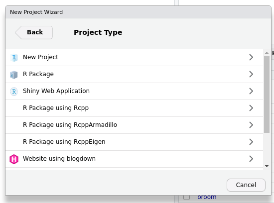
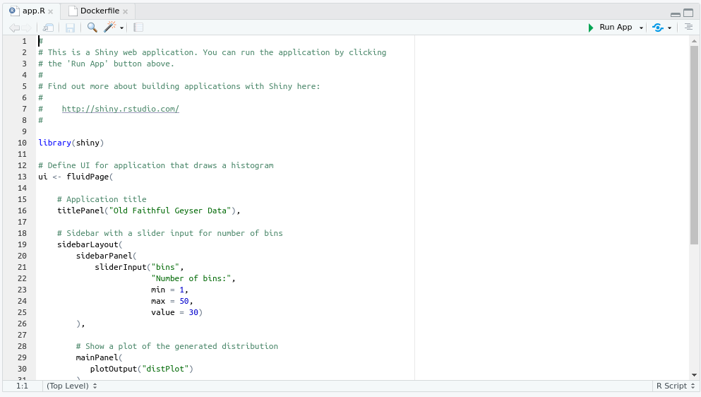

## DigitalOcean
This is a quick post to detail (perhaps a strong word) how I managed to deploy a Shiny app via the new [DigitalOcean app platform](https://www.digitalocean.com/products/app-platform/).  For those of you not familiar with DigitalOCean, they are a cloud provider with offers such as servers, databases, Kubernertes (whatever that is!) and more.  I have been using their servers for a while for various little proj3ects, but the app platform is new.  In theory it makes deploying apps much easier.

## Shiny
So I wanted to know if I could deploy a Shiny app via the app platform.  I like Shiny apps - they are a great way to put the power of R in the hands of those who do not know how to write R code.  I built a couple of apps in my previous job for interrogating databases and running biodiversity index calculations.  But deployment has always been a bit of an issue.  I know RStudio has a couple of options, but I wasn't that keen on them.  Custom URLs were either a bit clunky or expensive and I want an option I can manage myself.  I tried setting up Shiny Server on a DigitalOcean droplet, but without much success.  So that app platform seems to provide a neat way to do this.

## Basic workflow
The basic workflow is this:

+ create a Shiny app
* push it to GitHub (support for other providers is apparently on the way)
* connect the DO app platform to your repository
* AND deploy

It wasn't quite as easy as that, but with a little perseverance I managed.  So this is how I did it.  I am not claiming to be an expert in any of this, so there are probably better ways to do all this and I would love to hear how, but for now it provides a working solution.

## Create an app
For the purposes of my demo, I just used the default app that is created when you start a new project in RStudio.

This is a very basic demo app, but for my purposes is more than adequate to test how to deploy it.  Obviously I need to create something a bit more interesting or useful to explore the app platform fully.

## Create a Dockerfile
The DO app platform comes with built in support for lots of languages, but R isn't one of them (yet).  However, you can use Docker to deploy apps written in other languages.  I will not provide a full run down of Docker here (see [Colin Fay's introduction](https://colinfay.me/docker-r-reproducibility/)), but suffice it to say that Docker provides a virtual environment to run applications.  This includes an operating system and all of the other dependencies (like R, R packages etc...) needed to run an app.  There is an excellent project called [Rocker](https://www.rocker-project.org/) that provides Docker images for R projects, and I used one of these as a base for my deploy.

What we need to use Docker for deployment is a Dockerfile.  This is essentially a set of instructions which tells Docker what resources are required in a container.  I faffed around with this for a while, but in the end my Dockerfile is quite simple.  Here is the result:

`# Base image https://hub.docker.com/u/rocker/`  
`FROM rocker/shiny:latest`

`# system libraries of general use`    
`## install debian packages`    
`RUN apt-get update -qq && apt-get -y --no-install-recommends install \`  
`    libxml2-dev \`  
`    libcairo2-dev \`  
`    libsqlite3-dev \`  
`   libmariadbd-dev \`  
`    libpq-dev \`  
`    libssh2-1-dev \`  
`    unixodbc-dev \`  
`    libcurl4-openssl-dev \`  
`    libssl-dev'`  

`## update system libraries`  
`RUN apt-get update && \`  
`    apt-get upgrade -y && \`  
`    apt-get clean`  

`# copy necessary files`  
`## app folder`  
`COPY app.R /srv/shiny-server/app/`  

The first line, FROM, is to pull the base image from Rocker; this is like installing an R package.  The following section installs a bunch of system libraries that may be necessary to run R code.  To be honest I don't know what all of these are (I recognise some e.g. sqlite database) but I do not know if they are strictly necessary.  The third section is some standard command line code for updating Debian package repositories and operating system security updates etc.

The final bit is key.  Essentially it copies your app file (app.R) into a directory on Shiny server.  This means Shiny server will automatically pick up the app and serve it from this folder.

I had previously used the `renv` package in R to manage packages for the app, but as it only used the Shiny package it wasn't strictly necessary so I have not included that here.

We now how all the pieces we need to deploy the app via the DigitalOcean app platform.

## Push to Github
We now need to push all of our code into a Github repository.  I won't cover the details of that here, but there is an [excellent guide](https://happygitwithr.com/) if this is not something you are familiar with.  Assuming you have git installed and talking to Github (no easy task), the initialise git (`git init`), commit (`git commit -a -m first commit`), add a remote repository on Github (`git remote add origin https://github.com/username/repository`) and push your code to the repository.

If all is well you will find your code in your repository.  This is very much a cursory glance at adding code to a Github repository, so do not rely on it!  I am assuming you already know how to do all this!

## Deploy app on DigitalOcean
So, you now have code for a Shiny app in a Github repository.  I am going to assume you have a DigitalOcean account, but if not sign up for one.  You can use my [referral link](https://m.do.co/c/1c82d179ee2d) which will give us both a bit of credit.

In your account go to the 'Apps' menu and click on 'Create app'.  You will then need to connect to your Github repository from where DO will fetch your code. Remember to tick the continous deployment button; this means every time you push code to your repository, the app updates - like magic!

You then have to pick which data centre to use (limited at present) and the size of your server (I picked the smallest and cheapest one).  There may be one or two other things to do, but it is pretty simple.  Then hit deploy and hope fort the best.  It can take a while to build the image and deploy, but once it has there is a url to click to see the app.

If you have used my code then you will need to add '/app/' to the end of the URL to see the app, otherwise all you get is the Shiny Server landing page (which in itself is good news, as it means everything is working!).

DigitalOcean have their own [excellent guide](https://www.digitalocean.com/blog/introducing-digitalocean-app-platform-reimagining-paas-to-make-it-simpler-for-you-to-build-deploy-and-scale-apps/) to using the app platform, which is much more detailed than my description above.

You can add custom domains, but I have not figured that out yet - something to do with CNAME records which I do not fully understand!

So there you have it, a Shiny app deployed to DigitalOcean.

## Questions I have!

* How do I add a custom domain? It sounds easy but so far I have not got it to work!
* For a more complicated app, do I just put all of my code and files into an app directory?  Will Shiny Server know where to find all of the data etc...
* Does using `renv` make managing packages easier? Something to explore...

I will come back to try and answer these questions at some point.

## Next steps
For now I am going to go and develop a more useful (and probably more complex) app and test that.  I have a coupel fo ideas, so I will write about that when I have done so.

In the meantime all of my code is on [GitHub](https://github.com/drdcarpenter/test-app/tree/master)
